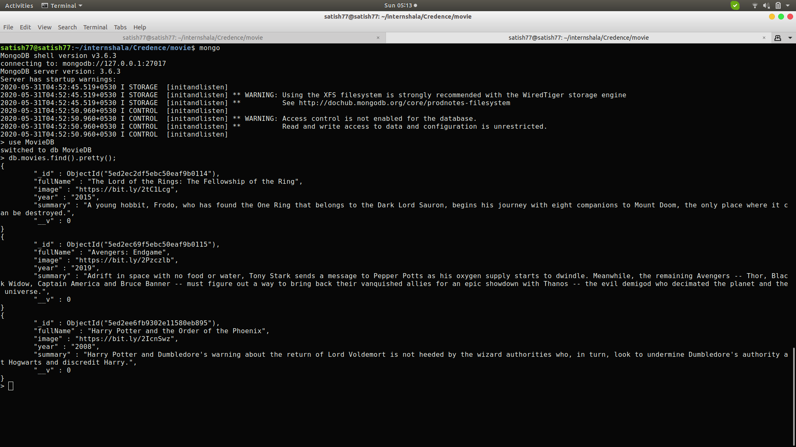
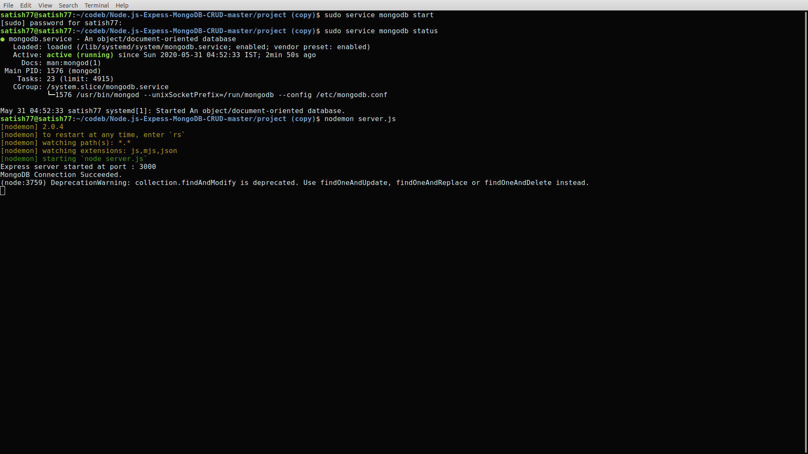
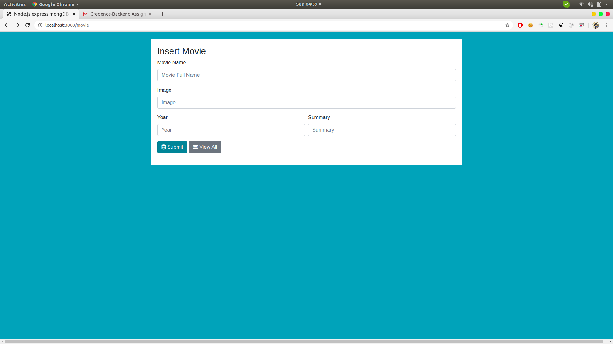
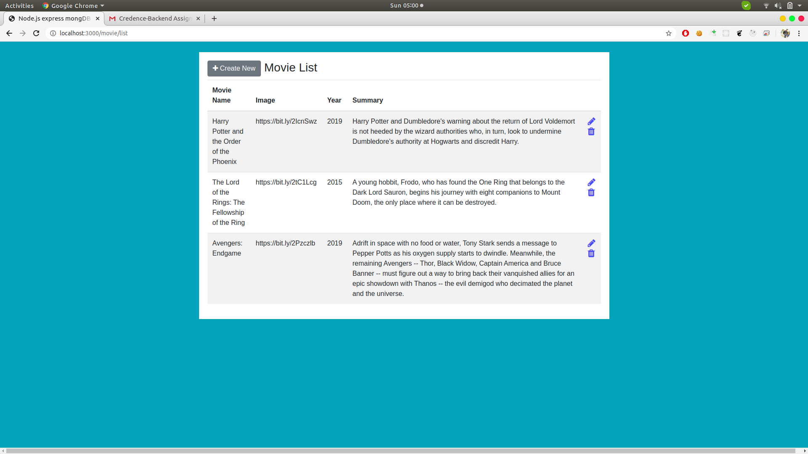
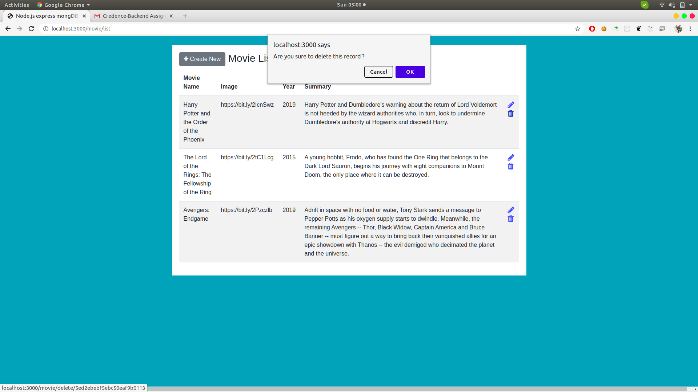
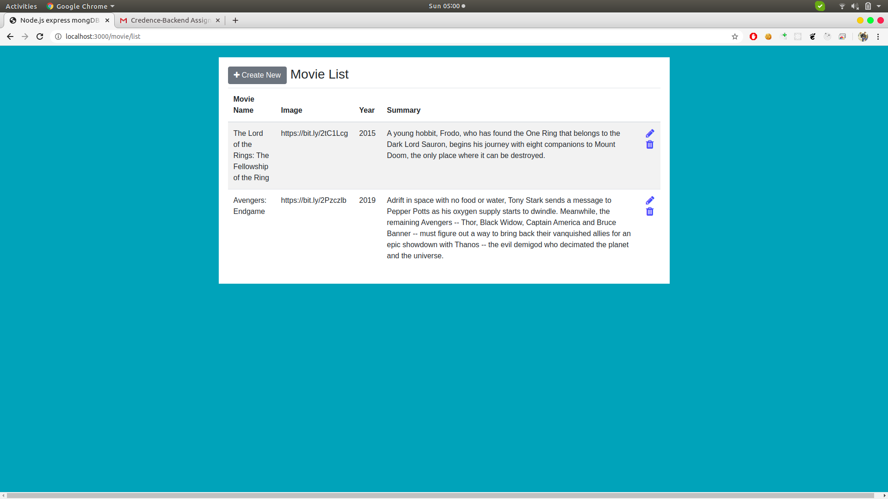

A)install following dependencies using ("npm install")

1)"body-parser"

2)"express"

3)"express-handlebars"

4)"mongoose"

5)"nodemon"

B)Create Database in MongoDB name : MovieDB and collection name movies

C)After installing dependencies run following command:

1)sudo service mongodb start

2)nodemon server.js

D)Check Working on localhost:3000

http://localhost:3000/movie/

Running:
Insert:

Read:

Update:

Delete:

Thank you,

NAME:SATISH SANGAM.
CONTACT:+917875478777
